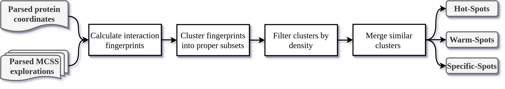
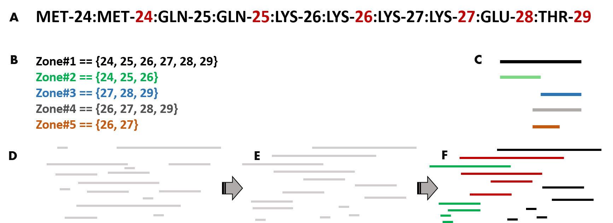

# **NUCLEAR methodological workflow**

## **NUCLEAR search of hotspots**

<figure markdown>
  { width="800" }
  <figcaption><strong>Figure 1:</strong> Workflow for the hotspots identification in a protein using NUCLEAR</figcaption>
</figure>

### **1\. Calculate replica's *fingerprints* from protein and MCSS explorations**

Each MCSS exploration comes in a crd file from which every replica (coordinates, names, and scoring) is extracted and their Cartesian coordinates saved as a kd-tree data structure. The Cartesian coordinates of the protein are also kept as a kd-tree. The computation of fingerprints is then conducted for each replica in each MCSS exploration (provided in the `[MCSS_files] section`).

A *fingerprint* is defined as the set of contacts between a particular MCSS replica and the protein. A *contact*  is the protein first atom under a cutoff distance from a replica atom (set with the `inter_dist` parameter).

### **2\. Cluster *fingerprints* into proper subsets**
<figure markdown>
  { width="600" }
  <figcaption><strong>Figure 2:</strong> Clustering of fingerprints into proper subsets</figcaption>
</figure>

Note that after the fingerprint definition, they can be expressed at least with two *resolutions*:
- **high-res (atomic-res)**: where the residue and the particular atom involved in the interaction are indicated.
- **low-res (residue-res)**: only the residue involved in the interaction is indicated.

NUCLEAR uses low-res fingerprints to locate the most interesting interacting regions of the protein (See Figures 2A and 2B). The main idea behind clustering fingerprints is that the bigger ones can be used as representative of many other tiny fingerprints that constitute proper subsets (See Figures 2B and 2C). The clustering of fingerprints occurs as follows:

1. Sort all fingerprints by increasing order of their size (from biggest to smallest) (see Figure 2E).
2. Take the most extensive fingerprint as the seed of a cluster in which all other fingerprints that are proper subsets of the seed will be saved (see Figure 2F).
3. Remove clustered fingerprints from consideration.
4. Starts from item 2 until no more fingerprints are available for clustering.

### **3\. Filter clusters by density**

Once we have obtained the subsets clusters, they can be filtered by their size. However, the size of the clusters is not normalized by the number of residues it contains. To leverage this situation, NUCLEAR employs the normalized ([0, 1]) density of a cluster as a population criterion to select the most representative clusters.

The density of a particular cluster is calculated as the number of replicas divided by the number of unique residues. These numbers are then normalized, and through the `density_cut` parameter, users can effectively discern the most representative clusters (in terms of size).  

### **4\. Merge similar clusters**

Each subset cluster already described has an associated seed that "represents" all other more minor fingerprints in the same cluster. As these seeds correspond to a protein region, they may overlap. A potential need to merge very similar areas may arise; thus, the `merge_cut` parameter can be helpful. 

The merging of clusters happens in NUCLEAR after the density filter and will use the Tanimoto index between seeds to decide if two clusters should be joined. The process always merges worst-ranked clusters with the best-ranked ones if their Tanimoto index is below the user-specified threshold.

The Tanimoto index between two seeds A, B is calculated as T(A, B) = 1-(intersection(A, B) / union(A, B)).

### **Hotspots output files**

- **overall_best_ranks.html:** This interactive plot shows the top-N at which to find the best-ranked replica of each explored group (y-axis) on each spot (x-axis).

- **overall_counts.html:** This interactive plot shows the number of replicas of each explored group (y-axis) on each spot (x-axis).

- **counting_by_top_X** *(X=5, 10, 50, 100, 500, 100)*:  These interactive plot shows the number of replicas of each explored group (y-axis) on each spot (x-axis) at the top-X. (Same information that *overall_counts.html* but top-X restricted).

- **overall_spotview.html:** This interactive plot shows the number of groups (y-axis) having at least one replica at the top-X on each spot (x-axis). X can be manually set to 5, 10, 50, 100, 500, or 1000.

- **overall_groupview.html:** This interactive plot shows the number of spots (y-axis) in which one can find a group (x-axis) at the top-X. X can be manually set to 5, 10, 50, 100, 500, or 1000.

- **fingerprints.log:** This logfile contain the following information:
	-  *ID:* spot ID (it is the same within all output files)
	-  *nGroupsTotal:* number of distinct groups present in that spot. 
	-  *PopTotal:* number of poses present in that spot (all groups included)
	-  *BestRank:* best rank for the poses present in that spot.
	-  *BestScore:* best score for the poses present in that spot.
	-  *Density:* the [0, 1] normalized density of that spot (calculated as the number of poses inside a spot divided by its number of unique residues).
	-  *Residues:* VMD selection to visualize spot's residues by index (starting from 0).
	-  *PopTop-X:* number of poses present in that spot under top-X, where X=[5, 10, 50, 100, 500, 1000]
	-  *nGroupsTop-X* number of distinct groups present in that spot under top-X, where X=[5, 10, 50, 100, 500, 1000].

- **spots_3D_Total.html:** This interactive plot constructed from the *fingerprints.log* data, shows for each spot; the number of distinct groups present (nGroupsTotal, x-axis),  the total number of poses, all groups included (PopTotal, y-axis), and the best rank from the included poses (BestRank, z-axis). The color of each spot represents their [0, 1] normalized density.  

- **spots_3D_top-X.html:** These interactive plots contain similar information to what is represented in *spots_3D_Total.html* but restricted to the top-X populations. Note however that Density and BestRank information of these graphs is the same retrieved in the *spots_3D_Total.html* plot.

- **mcss_box.log:** This logfile contains the size and coordinates (in MCSS order) of the minimal MCSS box that can gather all explored replicas.

- **representations2.vmd:** This is a VMD session to visualize each spot.

- **path_explored.vmd:** This is a VMD session to visualize the region (in red) being explored by the analyzed replicas.

- **TSV directory:** Inside this directory you will find all tabular data necessary to produce every html graph.

## NUCLEAR search of oligonucleotides

### All around or in a particular region of the protein ?
/examples/nuclear_allprot_allseq.cfg
/examples/nuclear_region_allseq.cfg

### With or without sequence constraints ?
/examples/nuclear_allprot_AAC..C.cfg
/examples/nuclear_hotspots.cfg

### Minimization of returned oligonucleotides ?
To complete upon future releases

### Oligonucleotides search output files
